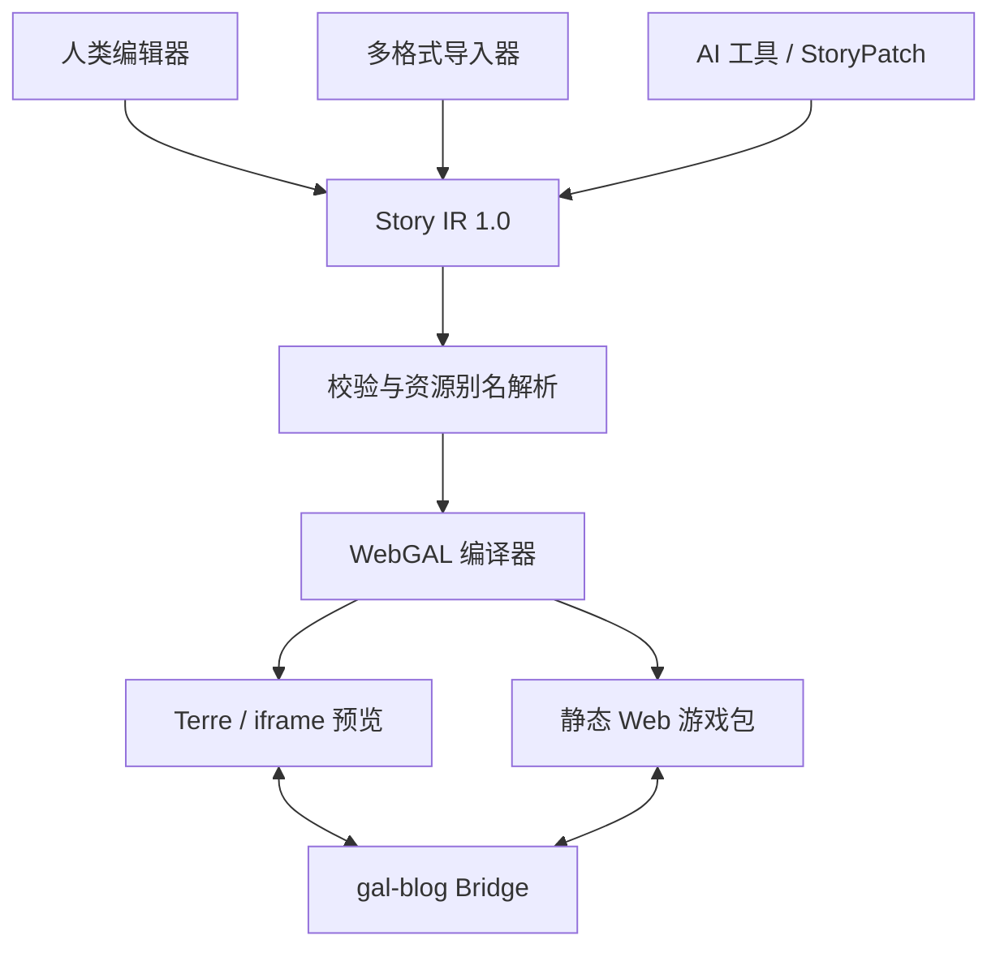

# 系统架构

## 设计原则

`StoryProject` 是唯一源数据。编辑器、AI、导入器和实时运行层都产生 Story IR 或 StoryPatch；WebGAL 脚本、Terre 工程和静态 Web 包都是可删除、可重建的产物。

## 分层

| 层 | 代码 | 职责 |
|---|---|---|
| 领域层 | `lib/story/types.ts` | StoryProject、剧情块、路线、资源、AI 配置 |
| 完整性层 | `lib/story/schema.ts` | Zod 结构校验、引用校验、资源缺失诊断 |
| 变更层 | `lib/story/patch.ts` | 可逆 set/insert/remove/move/test 操作 |
| AI 工具层 | `lib/story/aiTools.ts` | 将语义工具调用翻译为 StoryPatch |
| 导入层 | `lib/story/importers.ts` | JSON、Markdown、Ren'Py-like、WebGAL、标签、自然语言 |
| 演出预设层 | `lib/story/performancePresets.ts` | WebGAL Terre 官方动画表、友好别名、音量规范化 |
| 路线布局层 | `lib/story/routeLayout.ts` | 月姬式自上而下 DAG 布局与旧坐标兼容 |
| 编译层 | `lib/story/compiler.ts` | Story IR 到 WebGAL 4.6.2，连同官方动画文件打包 |
| 运行层 | `lib/story/runtime.ts` | 不依赖引擎的快速 Story IR 预览与调试 |
| 适配层 | `lib/integrations/*` | Terre API/WS 与安全 postMessage |
| 界面层 | `components/studio/*` | 编辑、地图、资源、AI、预览、导出 |

## 编辑与发布环境

编辑环境支持两种后端：

1. 纯浏览器：Story IR 保存在本地，内建模拟器预览，导出 ZIP。
2. 本地 Terre：Studio 调用 Terre 4.6.x API 创建工程、写入编译文件，并通过官方编辑预览 WebSocket 同步场景。

发布环境不依赖 Terre。导出包是静态文件，可放在 GitHub Pages、Cloudflare Pages 或任意静态托管，并通过 iframe 嵌入 gal-blog。

## AI 作者模式与实时模式

- 作者模式：AI 使用语义工具或 StoryPatch 对既有块做局部改动；操作进入历史，可撤销、比较和重新编译。
- 实时模式：上下文由角色 persona、当前场景、舞台状态、变量、历史和允许工具组成。模型只能返回有限数量的受约束操作。操作先校验，再进入 Story IR、预览和保存链路。
- Provider 是可插拔边界。第一版不在浏览器保存密钥；将模型服务放在可信后端，然后调用 Studio API。

## 上游复用策略

- WebGAL：保留其脚本语义、资源目录、运行、存档和 Web 发布；背景、立绘、BGM 与舞台特效编译到官方指令。
- Terre：使用真实管理 API、官方动画模板与 `webgal-editor-preview-sync.v1` 协议，不另造完整工程后端。
- tuan-chat-web：采用“统一消息/状态 → 编译行 → 增量文件写入 → iframe 同步”的架构，以及共享 loader 发布方式；没有复制其聊天/跑团业务。
- LetGal：采用“Block 是源数据、代码是视图”和作者叙事地图的交互原则。

## 云端迁移

领域层不接触文件系统。未来把本地 JSON 替换为数据库或对象存储时，只需实现 ProjectRepository、AssetStorage 和 AIProvider；Story IR、Patch、编译器与 UI 不需要改变数据语义。
